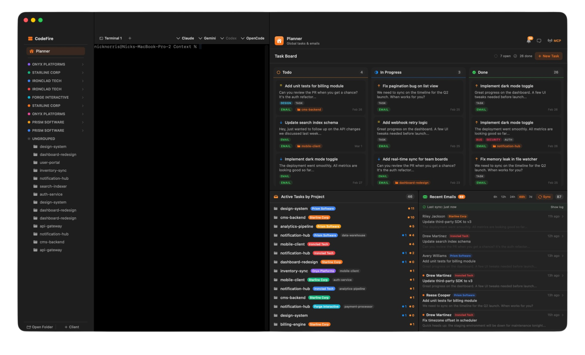
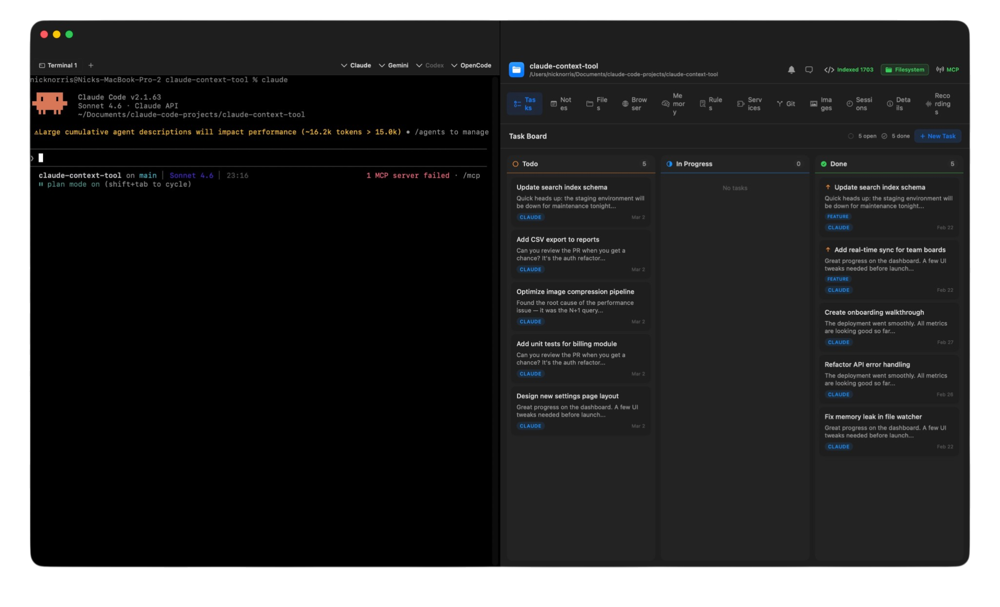
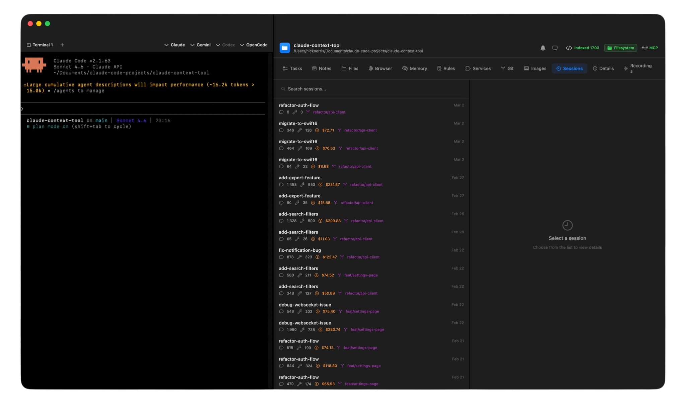
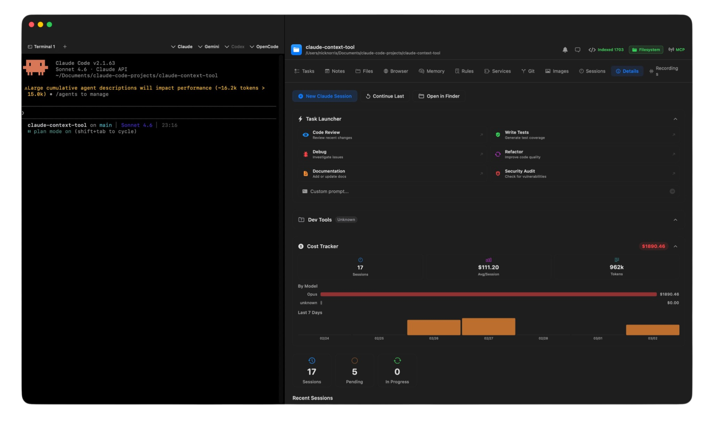
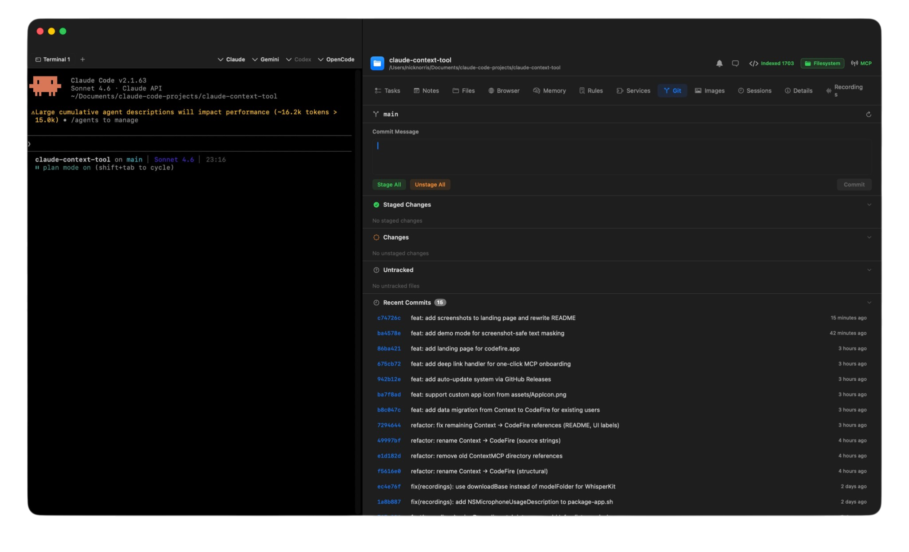
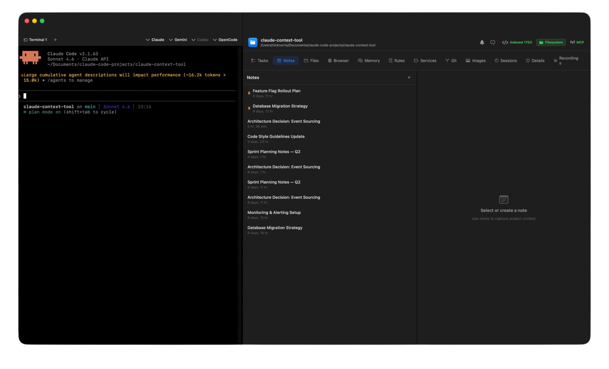
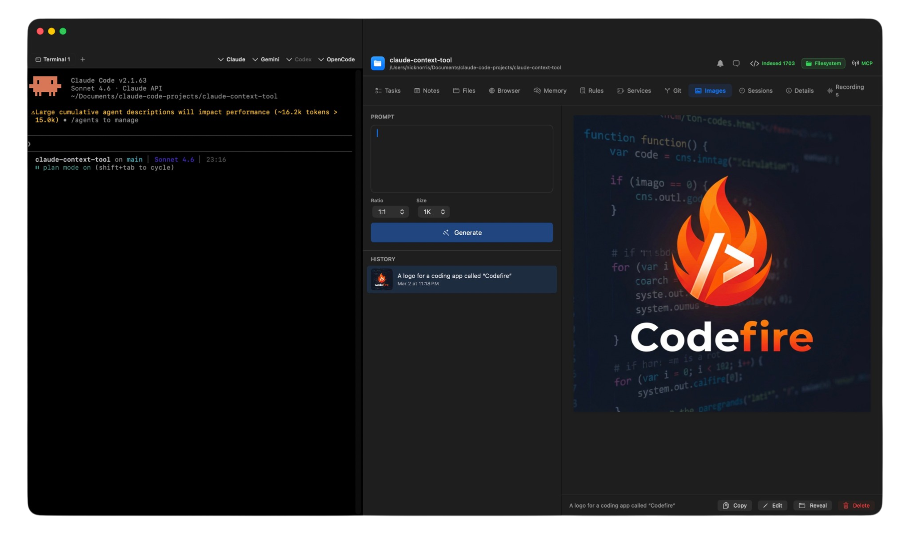

<p align="center">
  
</p>

<h1 align="center">CodeFire</h1>

<p align="center">
  <strong>Persistent memory for AI coding agents</strong><br>
  A native macOS companion for Claude Code, Gemini CLI, Codex CLI, and OpenCode
</p>

<p align="center">
  <a href="https://github.com/websitebutlers/codefire-app/releases/latest"></a>
  <a href="LICENSE"></a>
</p>

---

Your AI coding agent forgets everything between sessions. CodeFire fixes that. It auto-discovers your projects, tracks tasks and sessions, monitors live coding activity, and exposes project data back to your AI via MCP — creating a feedback loop where your agent knows what you're working on and can act on it.

<p align="center">
  
</p>

## Features

**Project management dashboard** — Auto-discovers all your Claude Code projects from `~/.claude/projects/`. Each project opens in its own window with an integrated terminal and tabbed GUI panel. The home view shows a global planner with tasks aggregated across all projects.

**Task tracking with Kanban board** — Drag-and-drop Kanban board (Todo / In Progress / Done) per project and globally. Tasks can be created manually, extracted from emails, or created programmatically by your AI agent through the MCP server. Priority levels, labels, notes, and full task history.

<p align="center">
  
  <br><em>Integrated terminal alongside the task board</em>
</p>

**Live session monitoring** — Real-time mission control for active Claude Code sessions. Watches the session JSONL file and displays token usage, cost tracking, tools invoked, files touched, and a live activity feed.

**Session history** — Parses and indexes all past Claude Code sessions. Browse conversations, review tool usage patterns, and track costs over time.

<p align="center">
  
  <br><em>Session history with cost tracking and tool usage stats</em>
</p>

**Built-in terminal** — Tabbed terminal emulator (SwiftTerm) embedded in each project window. Launch Claude Code sessions, run commands, manage multiple tabs — all without leaving the app.

**Task launcher & dev tools** — One-click actions for common workflows: code review, debugging, writing tests, refactoring, documentation, and security audits. Detects your project's package manager and provides quick-launch buttons for dev, build, test, and lint commands.

<p align="center">
  
  <br><em>Task launcher, dev tools, and per-project cost tracking</em>
</p>

**GitHub & Git integration** — See commits, staged changes, diffs, open PRs, and CI status. Full git visibility without leaving the app.

<p align="center">
  
  <br><em>Git integration with commits, staged changes, and diffs</em>
</p>

**Notes** — Per-project and global notes with a rich editor. Pin important notes, search across all notes, and use them to persist context between sessions.

<p align="center">
  
  <br><em>Per-project notes with pinning and search</em>
</p>

**AI image generation** — Built-in image studio for generating images with AI. Supports prompt-based generation with configurable aspect ratios and sizes.

<p align="center">
  
  <br><em>Built-in AI image generation</em>
</p>

**And more** — GitHub integration (PRs, CI, commits, issues), CLAUDE.md editor, file browser, built-in browser with screenshot capture, Gmail integration with auto-task creation, semantic code search, chat with Claude using full project context, and agent monitoring.

## MCP Server

CodeFire includes a companion MCP server (`CodeFireMCP`) that exposes your project data to any AI coding tool. When configured, your agent can:

- List and manage tasks (create, update status, add notes)
- Read project notes and search across them
- Access the codebase profile and file tree
- Query session history
- Navigate and interact with web pages
- Generate images

This creates a powerful loop: you manage work in CodeFire, and your AI has full awareness of that work during coding sessions.

## Getting Started

### 1. Download

Grab `CodeFire.app` from [GitHub Releases](https://github.com/websitebutlers/codefire-app/releases/latest) and drag it to your Applications folder.

### 2. Connect your CLI

Click one button in the app to install the MCP server, or configure it manually:

<details>
<summary><strong>Claude Code</strong></summary>

```bash
claude mcp add codefire ~/Library/Application\ Support/CodeFire/bin/CodeFireMCP
```
</details>

<details>
<summary><strong>Gemini CLI</strong></summary>

```json
// ~/.gemini/settings.json
{
  "mcpServers": {
    "codefire": {
      "command": "~/Library/Application Support/CodeFire/bin/CodeFireMCP",
      "args": []
    }
  }
}
```
</details>

<details>
<summary><strong>Codex CLI</strong></summary>

```toml
# ~/.codex/config.toml
[mcp_servers.codefire]
command = "~/Library/Application Support/CodeFire/bin/CodeFireMCP"
args = []
```
</details>

<details>
<summary><strong>OpenCode</strong></summary>

```json
// ~/.opencode/config.json
{
  "mcpServers": {
    "codefire": {
      "command": "~/Library/Application Support/CodeFire/bin/CodeFireMCP",
      "args": []
    }
  }
}
```
</details>

### 3. Code

Your AI agent now has persistent memory, task tracking, and project intelligence — across every session.

## Requirements

- macOS 14.0 (Sonoma) or later
- [Claude Code](https://docs.anthropic.com/en/docs/claude-code), [Gemini CLI](https://github.com/google-gemini/gemini-cli), [Codex CLI](https://github.com/openai/codex), or [OpenCode](https://github.com/sst/opencode)
- [GitHub CLI](https://cli.github.com/) (`gh`) for the GitHub tab (optional)

## Building from Source

```bash
git clone https://github.com/websitebutlers/codefire-app.git
cd codefire-app
bash scripts/package-app.sh
cp -r build/CodeFire.app /Applications/
```

## Architecture

CodeFire is a pure Swift Package Manager project with two executable targets:

| Target | Description |
|--------|-------------|
| `CodeFire` | Main GUI app — SwiftUI + AppKit, no Xcode project needed |
| `CodeFireMCP` | Standalone MCP server binary, communicates via stdio |

### Dependencies

| Package | Purpose |
|---------|---------|
| [GRDB.swift](https://github.com/groue/GRDB.swift) | SQLite database (shared between app and MCP server) |
| [SwiftTerm](https://github.com/migueldeicaza/SwiftTerm) | Terminal emulator |

No Electron. No web views (except the built-in browser). No node_modules. The entire app is ~16MB.

### Data Storage

All data lives in `~/Library/Application Support/CodeFire/codefire.db` — a single SQLite database shared by both the GUI app and the MCP server.

## License

MIT
